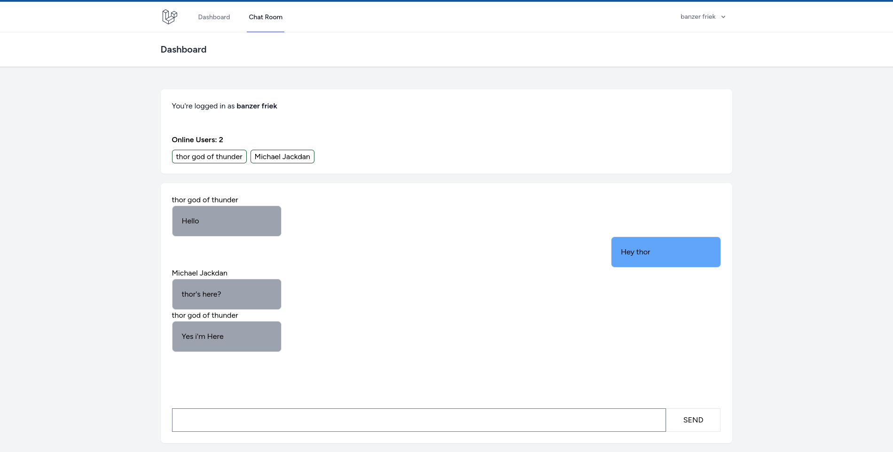

<p align="center"><a href="https://laravel.com" target="_blank"></a></p>

## Laravel + Pusher Demonstration




This is a basic chat application to showcase `laravel` + `Pusher`,

Project Dependencies

- Laravel 10+
- Composer
- PHP 8.1
- NodeJS
- MySQL

You must have a valid PUSHER account from [PUSHER.COM](https://pusher.com/)

- CLONE Project
```bash
git clone
```

- run composer install
```bash
composer install
```
- setup your database `.env` file
- run the migration
```bash
php artisan migrate
```
- install files needed for client
```bash
npm run install
```
- run the server
```bash
npm run dev
```

